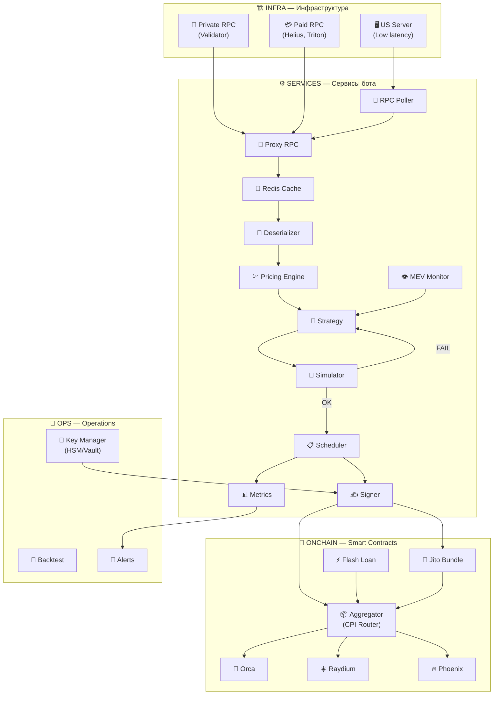
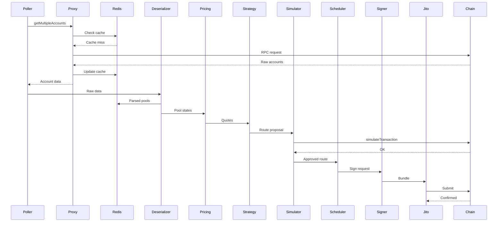

# Архитектура высокочастотного Arbitrage/Swap бота

## Mermaid-диаграмма



---

## 1. INFRA — Инфраструктура / Ноды

### 1.1 Private RPC (Приватный валидатор)

**Роль:** Главный источник данных с минимальной задержкой.

**Преимущества:**
- Быстрые `getMultipleAccounts` (< 50ms)
- Минимальная очередь Mempool
- Стабильная квота без rate limits
- Приоритетная отправка транзакций

**Используется для:**
- Получение состояния пулов
- `simulateTransaction`
- Отправка финальных транзакций

**Рекомендуемые провайдеры:**
- Собственный validator node
- Triton One (dedicated)
- Helius (dedicated tier)

### 1.2 Paid RPC (Резервные узлы)

**Роль:** Fallback и cross-validation.

**Провайдеры:**
| Провайдер | Tier | Latency | Rate Limit |
|-----------|------|---------|------------|
| Helius | Business | ~80ms | 500 RPS |
| Triton | Pro | ~60ms | 1000 RPS |
| QuickNode | VIP | ~100ms | 300 RPS |

**Используется для:**
- Отказоустойчивости
- Cross-validation данных
- Отправка TX при перегрузке приватного RPC

### 1.3 US Server (Compute платформа)

**Требования:**
- Локация: US East (Ashburn, VA) — ближе к Solana validators
- CPU: 8+ cores (AMD EPYC / Intel Xeon)
- RAM: 32+ GB
- Storage: NVMe SSD (высокие IOPS)
- Network: 10 Gbps, низкая jitter

**Рекомендуемые провайдеры:**
- Latitude.sh
- Vultr Bare Metal
- AWS c6i.xlarge (US East)

---

## 2. SERVICES — Главные сервисы бота

### 2.1 POLLER (RPC Poller)

```
┌─────────────────────────────────────────────┐
│                  POLLER                     │
├─────────────────────────────────────────────┤
│ Input:  Pool account addresses              │
│ Output: Raw account data → PROXY            │
├─────────────────────────────────────────────┤
│ Interval: 50-100ms                          │
│ Batch size: 100 accounts per request        │
│ Method: getMultipleAccounts                 │
└─────────────────────────────────────────────┘
```

**Задачи:**
- Постоянный опрос AMM/DEX пулов
- Сбор данных по ликвидности
- Формирование очереди для десериализации

**Ключевые метрики:**
- Accounts polled/sec
- RPC latency p99
- Data freshness

### 2.2 PROXY (Proxy RPC Service)

```rust
struct ProxyConfig {
    primary_rpc: String,      // Private RPC
    fallback_rpcs: Vec<String>, // Paid RPCs
    cache_ttl_ms: u64,        // 100-200ms
    batch_size: usize,        // 100
}
```

**Задачи:**
- Локальная RPC-прослойка
- Батчинг `getMultipleAccounts`
- Кэширование ALT аккаунтов
- Load balancing между RPC

**Оптимизации:**
- Connection pooling
- Request deduplication
- Prefetch hot accounts

### 2.3 REDIS (Cache Layer)

**Структура данных:**

```
pools:{pool_address}:state     → Borsh-encoded pool state
pools:{pool_address}:timestamp → Last update timestamp
alt:{alt_address}              → ALT accounts list
prices:{token_pair}            → Current price
```

**TTL политика:**
- Pool state: 100-200ms
- ALT: 5 минут
- Prices: 50ms

### 2.4 DESERIAL (Десериализатор)

**Поддерживаемые форматы:**

| DEX | Format | Struct |
|-----|--------|--------|
| Orca Whirlpool | Borsh | WhirlpoolState |
| Raydium CLMM | Borsh | PoolState |
| Phoenix | Zero-copy | MarketState |
| OpenBook | Zero-copy | MarketState |

**Выходные данные:**
```rust
struct ParsedPool {
    address: Pubkey,
    token_a: TokenInfo,
    token_b: TokenInfo,
    sqrt_price: u128,
    liquidity: u128,
    tick_current: i32,
    fee_rate: u16,
    last_updated: u64,
}
```

### 2.5 PRICING (Ценовой движок)

**AMM формулы:**

**Constant Product (x * y = k):**
$$
\Delta y = \frac{y \cdot \Delta x}{x + \Delta x}
$$

**Concentrated Liquidity (Uniswap v3 style):**
$$
\Delta y = L \cdot (\sqrt{P_{upper}} - \sqrt{P_{current}})
$$

**Учитываемые факторы:**
- Fee tier (0.01%, 0.05%, 0.30%, 1.00%)
- Price impact
- Current tick position
- Available liquidity in range

### 2.6 STRATEGY (Маршрутизация)

**Типы маршрутов:**

```
2-hop: A → B → A (direct arbitrage)
3-hop: A → B → C → A (triangular)
Multi-venue: A@Orca → B@Raydium (cross-DEX)
```

**Фильтрация:**
```rust
struct ProfitFilter {
    min_profit_bps: u16,     // 5-10 bps minimum
    max_slippage_bps: u16,   // 50 bps max
    min_liquidity: u64,      // $10k minimum
    gas_estimate: u64,       // ~5000 lamports
}
```

**Profit calculation:**
$$
profit = out_{final} - in_{initial} - gas - jito\_tip
$$

### 2.7 SIM (Симулятор)

**Проверки:**
1. ✅ Swap пройдёт успешно
2. ✅ Нет конфликтов аккаунтов
3. ✅ Цены не изменились критично
4. ✅ Достаточно compute units

**Результаты:**
- `OK` → Scheduler
- `FAIL` → Strategy (пересчёт)

### 2.8 SCHED (Scheduler)

**Функции:**
- Rate limiting (max TX/sec)
- Backoff при ошибках
- Очередь на подписание
- Priority queue для profitable trades

### 2.9 SIGNER (Подписание)

**Процесс:**
1. Получить recent blockhash
2. Построить message с ALT
3. Подписать (Ed25519)
4. Отправить через Jito или RPC

**Безопасность:**
- HSM интеграция (опционально)
- Key rotation
- Multi-sig для крупных сумм

### 2.10 MEV_MON (MEV мониторинг)

**Отслеживание:**
- Leader schedule
- Крупные TX в mempool
- Suspicious patterns

**Действия:**
- Задержка отправки
- Смена маршрута
- Увеличение tip

### 2.11 METRICS

**Собираемые метрики:**
```
# Latency
rpc_latency_ms{endpoint="primary"}
deserialize_latency_us{pool_type="orca"}
total_pipeline_latency_ms

# Business
profitable_routes_found
trades_executed
pnl_total_usd
success_rate

# Errors
rpc_errors_total
simulation_failures
timeout_count
```

---

## 3. ONCHAIN — Smart Contracts

### 3.1 AGG (Aggregator)

**Anchor программа:**

```rust
#[program]
pub mod swap_aggregator {
    pub fn execute_route(
        ctx: Context<ExecuteRoute>,
        route: Vec<SwapLeg>,
        min_out: u64,
    ) -> Result<()> {
        // CPI to each DEX
        for leg in route {
            match leg.dex {
                Dex::Orca => cpi_orca_swap(...),
                Dex::Raydium => cpi_raydium_swap(...),
                Dex::Phoenix => cpi_phoenix_swap(...),
            }
        }
        // Verify min_out
        require!(final_balance >= min_out, SlippageExceeded);
        Ok(())
    }
}
```

### 3.2 DEX интеграции

| DEX | CPI | SDK |
|-----|-----|-----|
| Orca Whirlpool | `whirlpool::cpi::swap` | orca-whirlpools-sdk |
| Raydium CLMM | `raydium_clmm::cpi::swap` | raydium-amm-v3 |
| Phoenix | `phoenix::cpi::swap` | phoenix-sdk |

### 3.3 JITO Bundle

**Преимущества:**
- Atomic execution
- MEV protection
- Priority landing

**Структура bundle:**
```
Bundle {
  transactions: [
    tx1: swap A → B,
    tx2: swap B → C,
    tx3: swap C → A,
  ],
  tip: 10000 lamports
}
```

---

## 4. OPS — Operations

### 4.1 KEY_MAN

**Уровни безопасности:**

| Level | Method | Use case |
|-------|--------|----------|
| Dev | File keypair | Testing |
| Prod | Hashicorp Vault | Standard |
| High-sec | YubiHSM2 | Large funds |

### 4.2 BACKTEST

**Среды:**
- Devnet: функциональное тестирование
- Testnet: нагрузочное тестирование
- Offline: исторические данные

### 4.3 ALERTS

**Триггеры:**
- TX latency > 400ms SLA
- RPC degraded
- P&L < threshold
- High simulation failure rate

---

## Data Flow (Sequence)



---

## Latency Budget

| Stage | Target | Max |
|-------|--------|-----|
| RPC polling | 30ms | 50ms |
| Deserialization | 5ms | 10ms |
| Pricing | 2ms | 5ms |
| Strategy | 5ms | 10ms |
| Simulation | 50ms | 100ms |
| Signing | 1ms | 2ms |
| Jito submission | 20ms | 50ms |
| **Total** | **113ms** | **227ms** |

---

## Масштабирование

### Горизонтальное

- Несколько POLLER инстансов (по пулам)
- Шардирование Redis
- Multiple signers

### Вертикальное

- Более мощные CPU для десериализации
- Больше RAM для кэша
- Faster NVMe для логов

